::: cover

# FastAccounts

#### User Guide — Client Books and Payroll for Accounting Bureaus

**Invoices, banking, ledger, VAT and Estonian payroll in one bureau workspace.**

Worked example: Põhjatäht Teenused OÜ, Northstar Studio Ltd and Demo OÜ (sample payroll)

v0.4.0 · 9 October 2026 · Local demonstration edition

:::

---

## Contents

| Section | Pages / slides | What you will do |
|---|---:|---|
| **01 · Get started** | 3–11 | Sign in with Google or email, create an account, reset a password, switch client books |
| **02 · Sales, purchases and automation** | 12–18 | Invoices, bills, contacts, recurring invoices and reminders |
| **03 · Banking, accounting and tax** | 19–22 | Reconcile the bank, read reports, prepare Estonian KMD workpapers |
| **04 · Payroll for accounting bureaus** | 23–32 | Part-time, hourly and board pay, social tax minimum, pay runs, payslips |
| **05 · Integrations and HR import** | 33–40 | Connect FastHR or import a CSV, and review employees before payroll changes |
| **06 · Reference** | 41–43 | 2026 Estonian rates, exemptions, languages and limits |

Screenshots come from a local instance seeded with synthetic demo books. Names,
personal codes, IBANs and e-mail addresses are test data, not real people or
companies. The FastHR import uses a mocked FastHR API.

---

::: divider

## Get started

One workspace for every client: switch books from the sidebar, keep each
client's ledger separate, and work in English or Estonian.

:::

---

## The public site

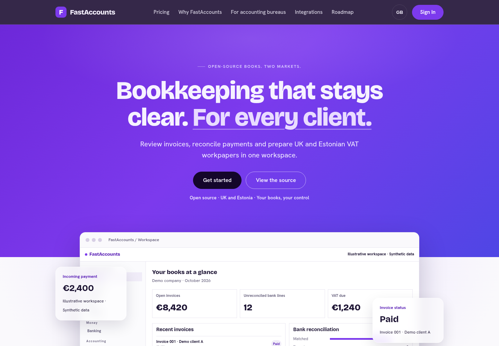

**fastaccounts.org** introduces the product for UK and Estonian books.

- **Get started** and **Sign in** lead to the workspace.
- **Integrations** lists every connector with its real status.
- **Pricing**, **Why FastAccounts**, **For accounting bureaus** and **Roadmap** explain the offer.
- Switch the language with the language button (GB / EE) in the top bar; the choice is remembered.

The version link in the footer opens `/healthz`, which shows the running
release and database status.

---

## Sign in

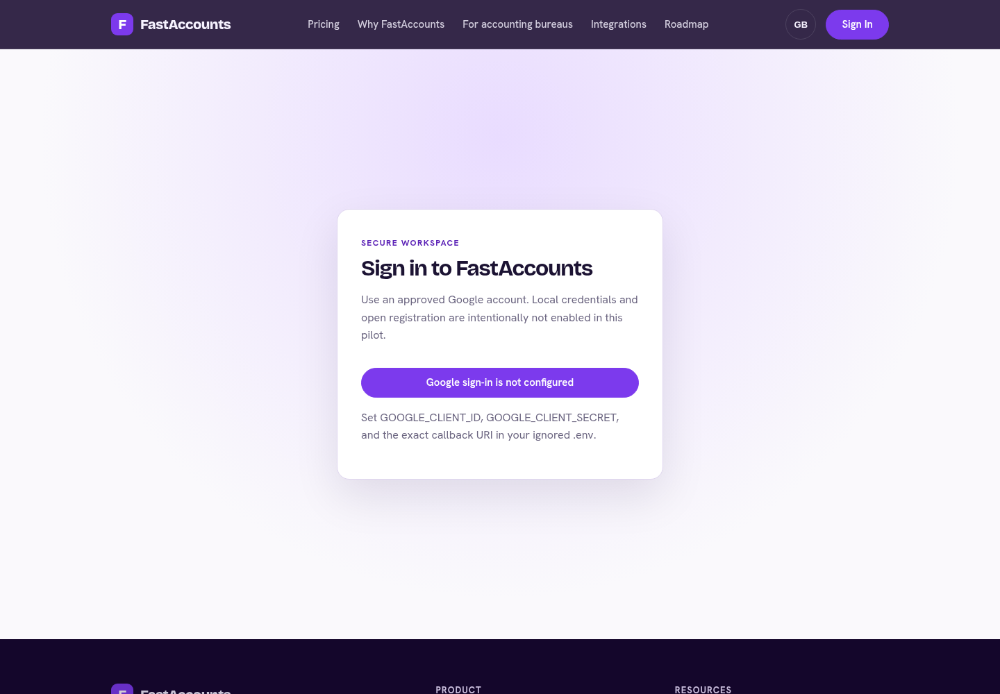

1. Open **Sign in** and choose **Continue with Google**, or enter your
   **Email** and **Password** and choose **Sign in with email**.
2. Use the address your bureau invited or approved; both methods open the same
   account, so a Google user can also set a password.
3. The workspace opens on the **Overview**.

The local demonstration shown here has no Google credentials configured, so
the Google button reports that; production offers both options.

---

## Create an account

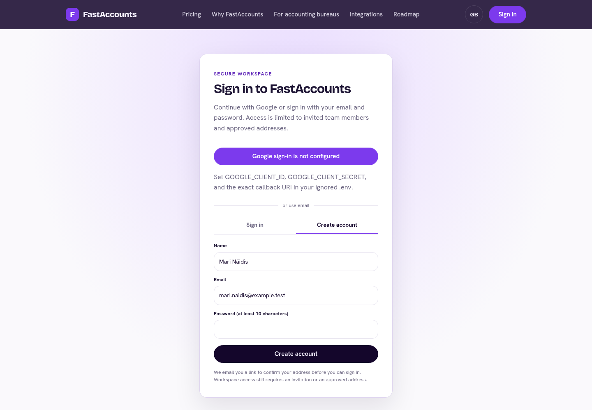

1. On **Sign in**, open the **Create account** tab.
2. Enter your **Name**, **Email** and a **Password (at least 10 characters)**.
3. Choose **Create account** and open the confirmation link we email you.
4. Enter the same password to **Confirm email**; the workspace opens.

Access still requires an invitation or an approved address. The message after
sign-up is the same whether or not the address can register.

---

## Forgot your password

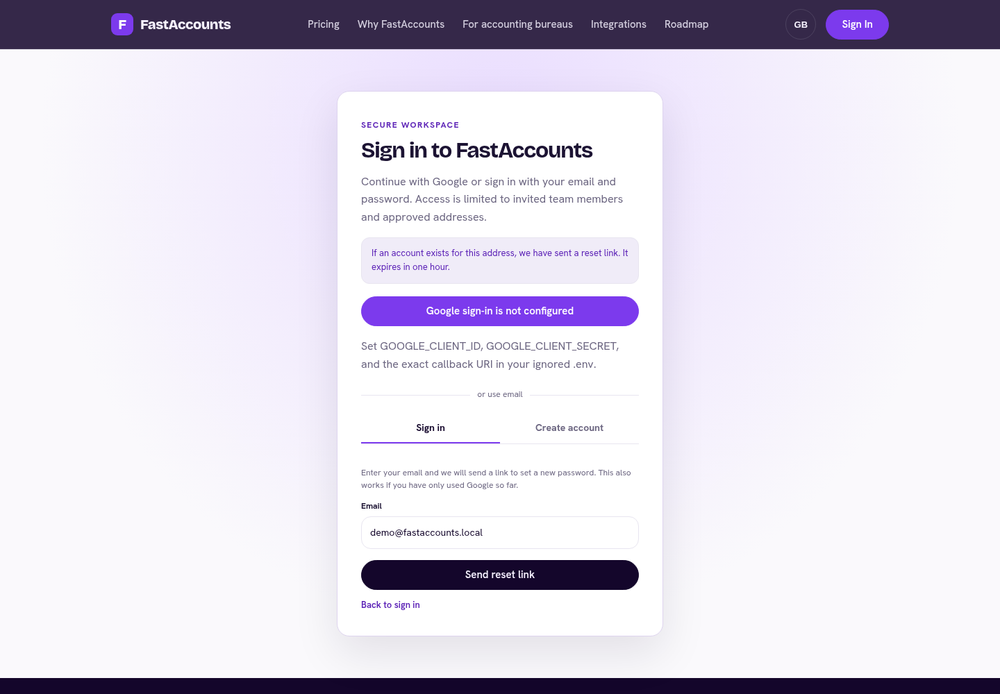

1. Choose **Forgot password?** under the password field.
2. Enter your **Email** and choose **Send reset link**.
3. Open the link in the email within one hour; it works once.

This is also how a Google user adds a password. Repeated attempts are paused
for a while to protect accounts.

---

## Choose a new password

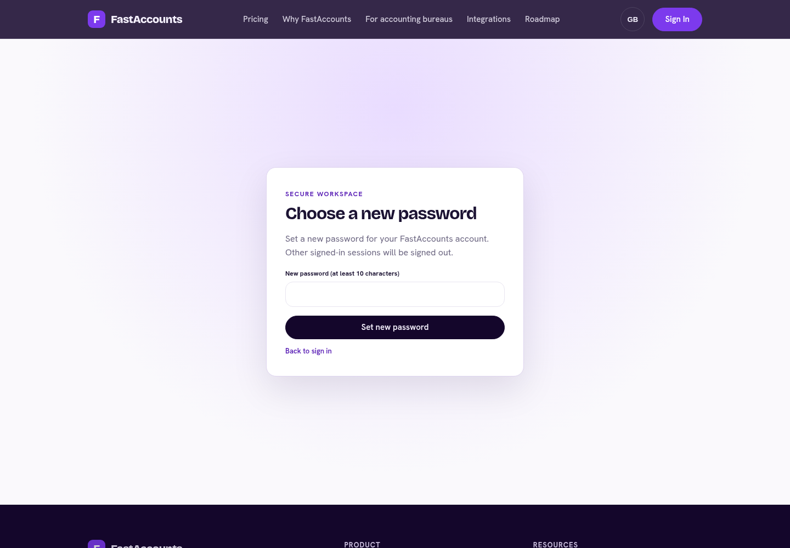

1. Enter a **New password (at least 10 characters)**.
2. Choose **Set new password**.
3. Sign in again with the new password.

Changing the password signs out every other browser where the account was
signed in.

---

## Bureau overview

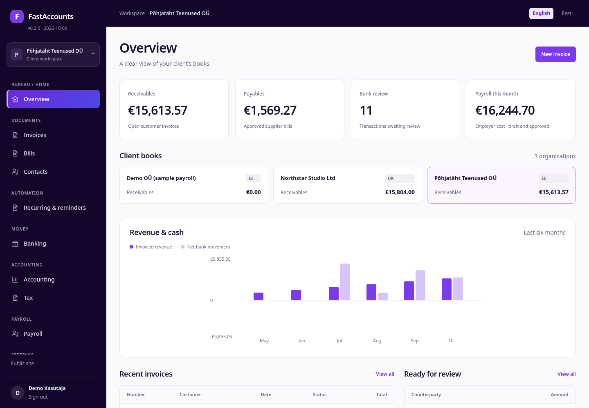

**Overview** summarises the selected client's books:

- **Receivables** and **Payables** — open customer invoices and approved bills.
- **Bank review** — bank lines still waiting for a match.
- **Payroll this month** — employer cost of draft and approved pay runs.

**Client books** lists every organisation you can access, with receivables per
client. The chart compares invoiced revenue with net bank movement for the
last six months. **New invoice** starts a sales invoice straight away.

---

## Switch between clients

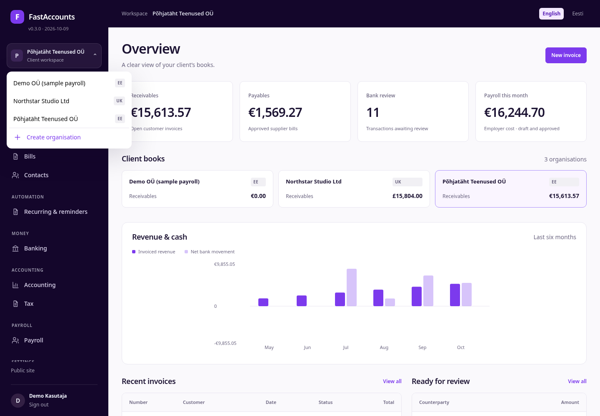

Each client is a separate organisation with its own chart of accounts,
documents, bank accounts, payroll and integrations.

1. Click the organisation card at the top of the sidebar.
2. Pick a client; the country badge (EE / UK) shows its rule set.
3. **Create organisation** adds a new client's books.

Payroll is enabled only for Estonian organisations with EUR books; for other
clients the **Payroll** menu item is greyed out with an explanation.

---

## Workspace language and version

- **English / Eesti** in the top bar switches every label, message and error.
  Your choice is kept for the next visit. Estonian payslips are always in Estonian.
- The version chip under the logo (`v0.4.0 · 2026-10-09`) shows the release you
  are using; click it to open the health check.
- **Public site** and **Sign out** are at the bottom of the sidebar.

On narrow screens the sidebar folds into the **☰** menu.

---

::: divider

## Sales, purchases and automation

Issue invoices, review supplier bills and let recurring invoices and the
reminder ladder do the routine work.

:::

---

## Sales invoices

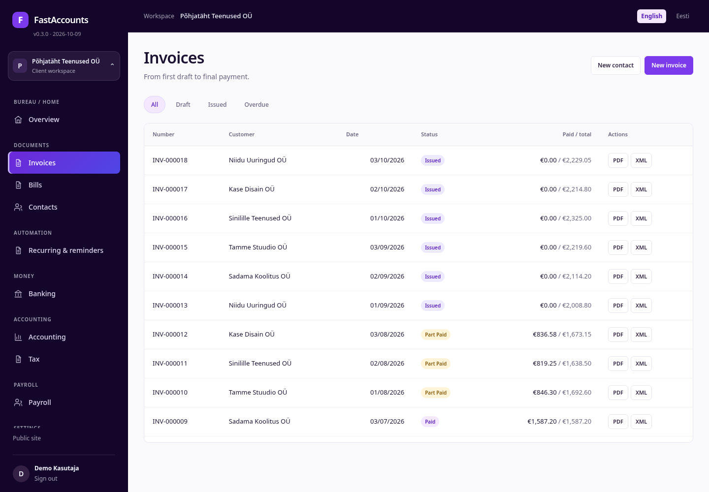

**Invoices** shows every sales invoice with its status: **Draft**, **Issued**,
**Part paid**, **Paid** or **Overdue**. Filter with the tabs above the list.

- **PDF** downloads the invoice; **XML** downloads it as structured XML.
- Open a draft to edit, issue or delete it. Issued invoices are immutable and
  are posted to the ledger.
- **New contact** adds a customer without leaving the page.

---

## Create an invoice

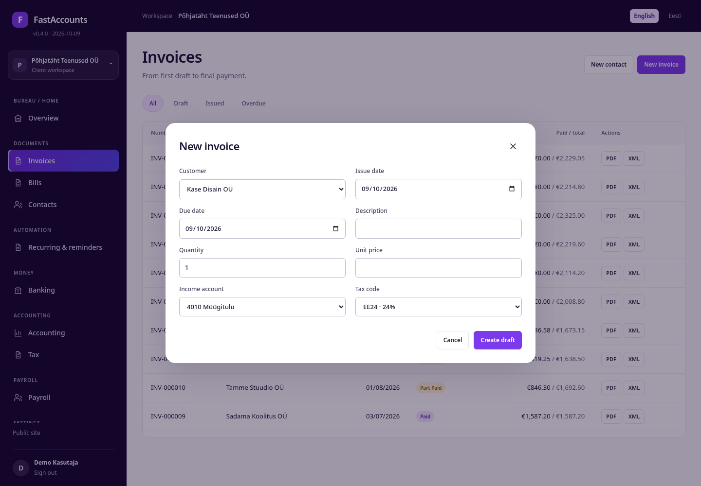

1. Click **New invoice**.
2. Choose the **Customer**, **Issue date** and **Due date**.
3. Enter the **Description**, **Quantity** and **Unit price**.
4. Pick the **Income account** and **Tax code** (for example EE24 – 24%).
5. **Create draft**, review it, then **Issue**.

VAT is calculated per line with exact decimals and posted to the client's
VAT accounts when the invoice is issued.

---

## Supplier bills

**Bills** holds supplier documents before they reach the ledger.

- Statuses run **In review → Approved → Part paid → Paid**.
- **Approve** posts the bill; nothing is posted while it is in review.
- **New bill** and **New supplier** add documents and counterparties.

Use the review step for anything an accountant must check first, such as
reverse-charge or non-deductible VAT.

---

## Contacts

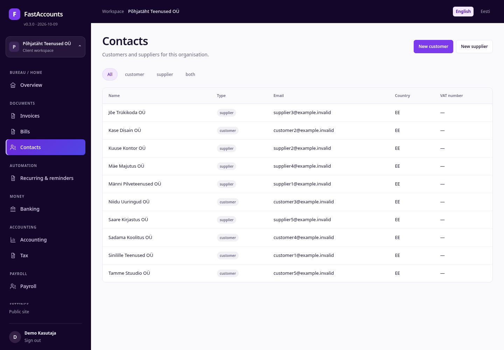

**Contacts** keeps customers and suppliers per client, with type, e-mail,
country and VAT number. Filter by **customer**, **supplier** or **both**.

Contacts are reused by invoices, bills, bank matching and recurring
schedules, so keep e-mail addresses current: payment reminders go there.

---

## Recurring invoices and reminders

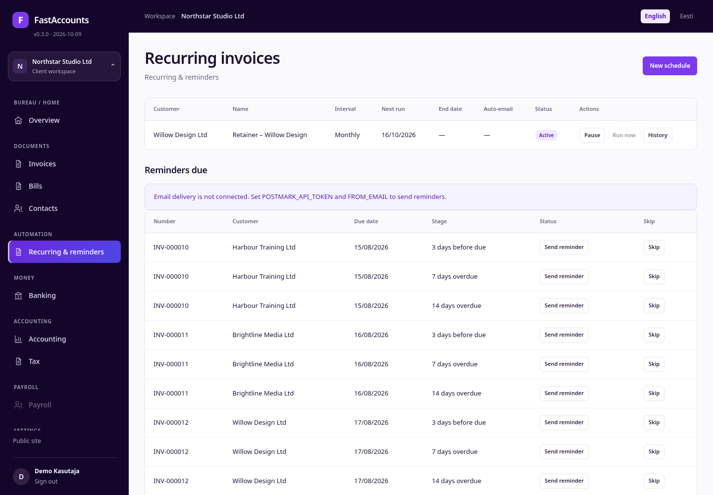

**Recurring & reminders** lists invoice schedules and the reminder ladder.

- A schedule copies a template invoice **weekly**, **monthly**, **quarterly** or
  every *n* days. **Run now** is enabled once the next run date is due;
  **Pause** and **History** manage the schedule.
- **Reminders due** lists overdue invoices at each step: 3 days before due,
  7 days overdue and 14 days overdue. **Send reminder** or **Skip** each one.

E-mail delivery needs `POSTMARK_API_TOKEN` and `FROM_EMAIL`; until then the page
says so and nothing is sent.

---

## Create a recurring schedule

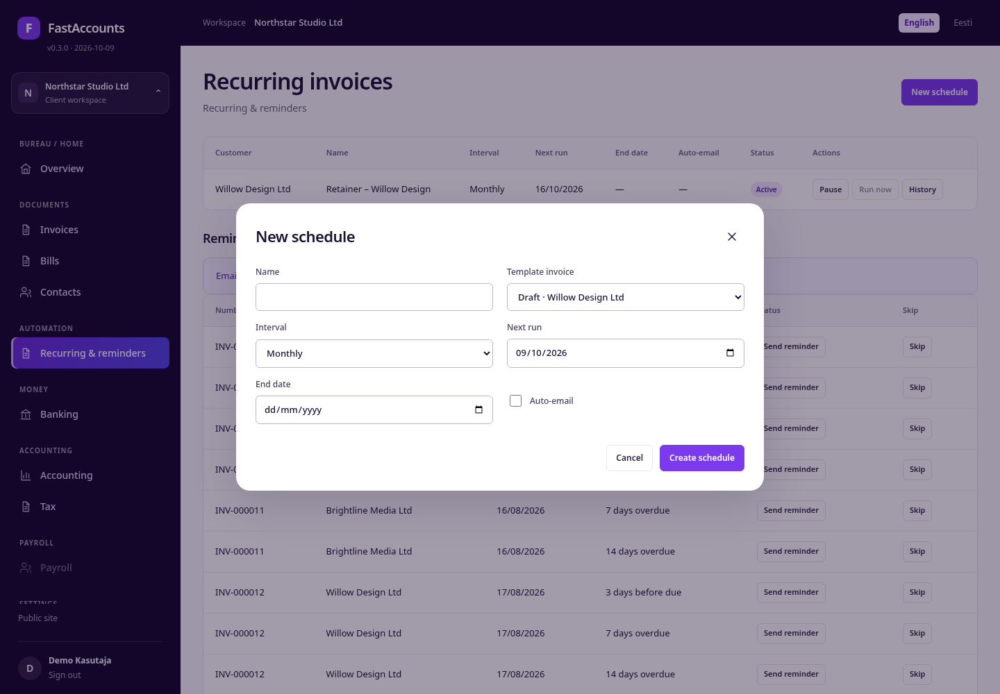

1. Create and save a draft invoice to use as the **Template invoice**.
2. Click **New schedule** and give it a **Name**.
3. Choose the **Interval**, the **Next run** date and an optional **End date**.
4. Tick **Auto-email** to send each new invoice automatically.
5. **Create schedule**.

Each run creates a normal invoice from the template, so numbering, VAT and
posting follow the same rules as invoices you create by hand.

---

::: divider

## Banking, accounting and tax

Match bank lines to documents, read the ledger and prepare VAT workpapers
for accountant review.

:::

---

## Banking and reconciliation

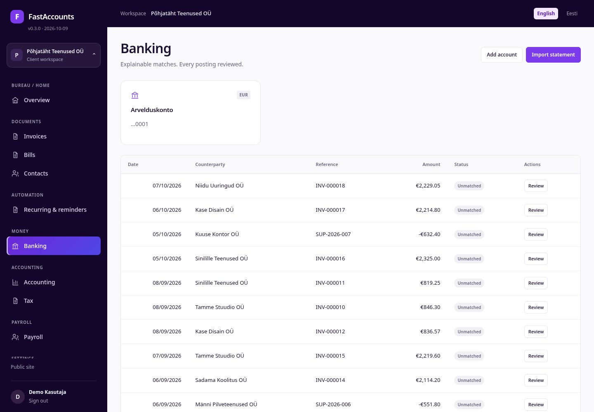

**Banking** shows each bank account and its imported transactions.

1. **Import statement** (CSV or CAMT.053 XML).
2. Each unmatched line offers explainable match suggestions; click **Review**.
3. **Confirm match** to allocate the payment to invoices or bills.

**Add account** registers another bank account for the client. Confirmed
matches post the payment and update invoice and bill statuses.

---

## Accounting reports

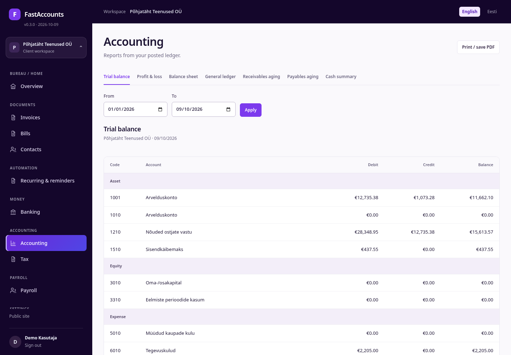

**Accounting** builds reports from the immutable, balanced ledger:

- **Trial balance**, **Profit & loss**, **Balance sheet**
- **General ledger** with every posting and its reference
- **Receivables aging**, **Payables aging** and **Cash summary**

Choose **From** and **To**, click **Apply**, and use **Print / save PDF** for the
client file. Postings are never edited; corrections are new entries.

---

## Estonian VAT (KMD) workpapers

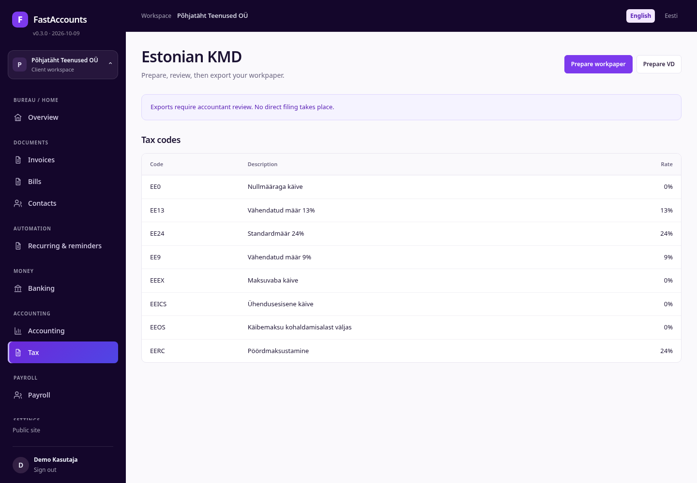

**Tax** prepares the Estonian **KMD** (and the UK nine-box VAT return for UK books).

1. **Prepare workpaper** for the period.
2. Check the boxes against the listed tax codes.
3. **Mark accountant reviewed** before exporting.

**Prepare VD** builds the EU sales listing. Exports require accountant review;
FastAccounts does not file directly with EMTA or HMRC.

---

::: divider

## Payroll for accounting bureaus

Estonian 2026 payroll per client: monthly, part-time, hourly and board-member
pay, the social tax minimum, payslips and automatic ledger postings.

:::

---

## Employees

Open **Payroll** in an Estonian EUR client (here **Demo OÜ (sample payroll)**).

- **Gross salary** shows monthly pay, or the **hourly rate per hour**.
- Part-time staff show their fraction (**Part-time 0.5**); board members carry a
  **Board member** badge.
- **Pension %** is the II pillar rate (0, 2, 4 or 6%).
- **Tax-free minimum** shows who applies the €700 basic exemption here.

**Add employee** and **Run payroll for month** are at the top right.

---

## Part-time employee

1. **Pay basis**: **Monthly salary**.
2. **Monthly salary or board fee**: the contractual monthly gross (€700).
3. **Work-time fraction (FTE)**: 0.5 for half time.
4. **Pension %**: 0% is allowed for anyone not in the II pillar.

The minimum-wage check is pro-rated: €946 × 0.5 = €473 from 1 April 2026
(€886 before). Set **Employment start date** and **end date** so pay runs skip
people outside their employment.

---

## Hourly employee

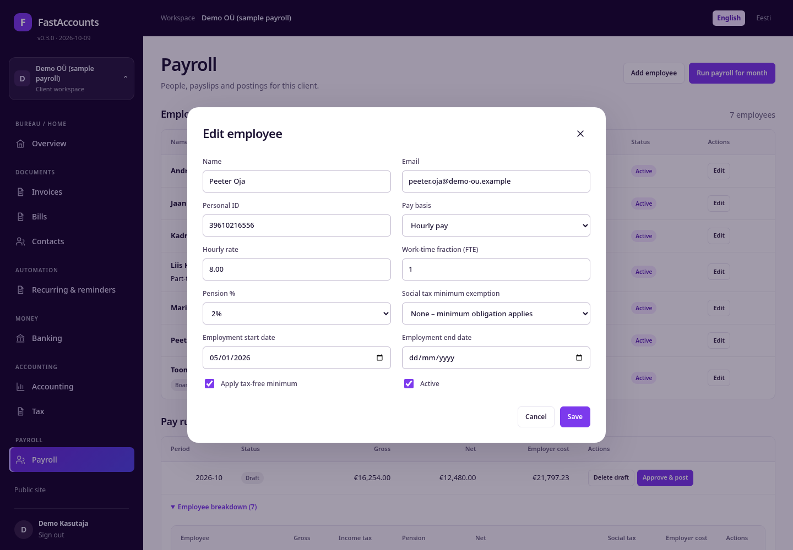

1. **Pay basis**: **Hourly pay**.
2. **Hourly rate**: €8.00 here; the minimum is €5.67/h from 1 April 2026
   (€5.31 before).
3. Hours are entered in each month's pay run.

**Board member fee** is the third pay basis: no unemployment insurance and no
social tax minimum. **Social tax minimum exemption** records why the minimum
does not apply to a person (see the reference section).

---

## Review a draft pay run

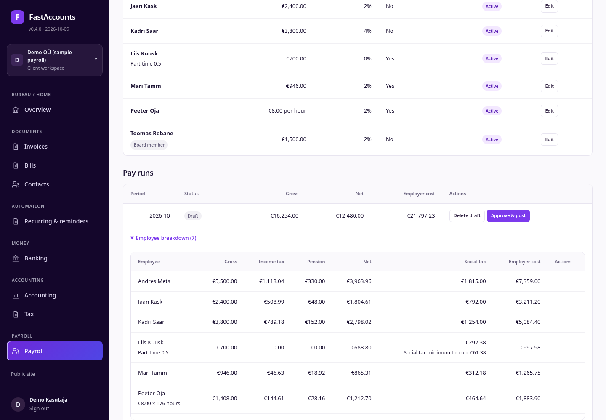

The October 2026 draft lists gross, net and employer cost for the client
(€16,254.00 gross, €21,797.23 employer cost). **Employee breakdown** shows:

- **Peeter Oja**: €8.00 × 176 hours = €1,408.00 gross.
- **Liis Kuusk** (0.5 FTE, €700): social tax €292.38, including a
  **Social tax minimum top-up** of €61.38 paid by the employer.
- Income tax, II pillar, net pay and employer cost per person.

---

## Run payroll for a month

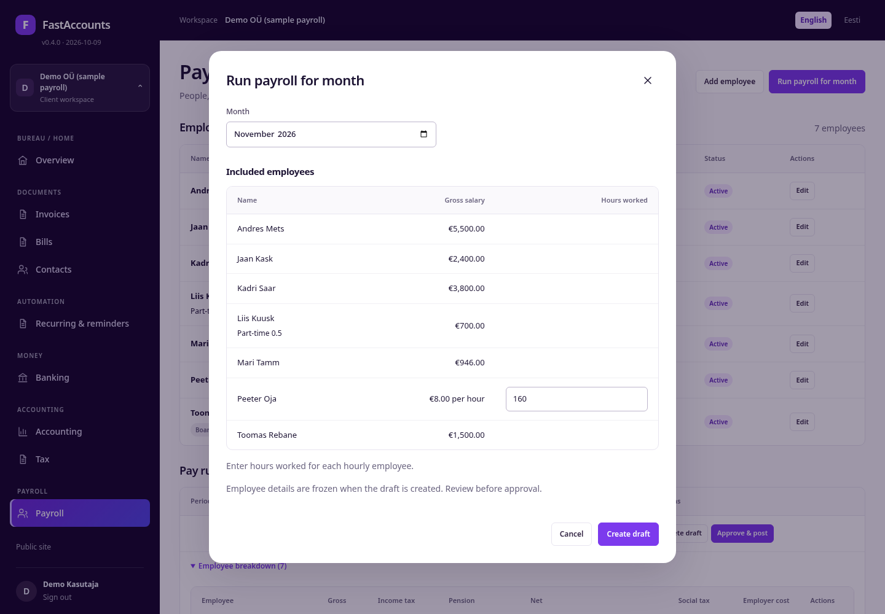

1. Click **Run payroll for month** and choose the **Month**.
2. Check the **Included employees** (active and employed in that month).
3. Enter **Hours worked** for each hourly employee.
4. **Create draft** and confirm.

Employee details are frozen in the draft, so later edits do not change it.
A failed minimum-wage check names the employee and the amount.

---

## Approve and post

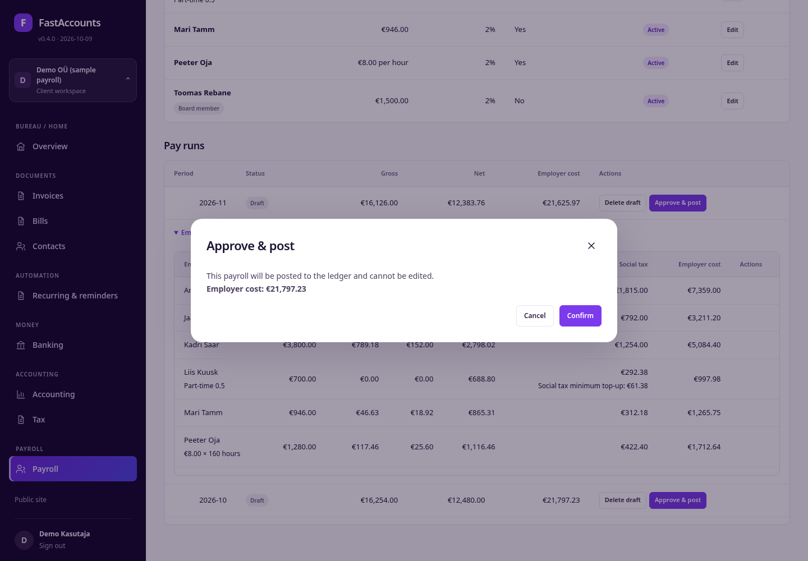

**Approve & post** shows the employer cost and asks for confirmation.
Approval:

- posts one balanced payroll entry to the client's ledger;
- locks the run (delete or edit only while it is a draft);
- makes the **Payslips PDF** available.

Delete a wrong draft with **Delete draft** and create it again.

---

## Payslips

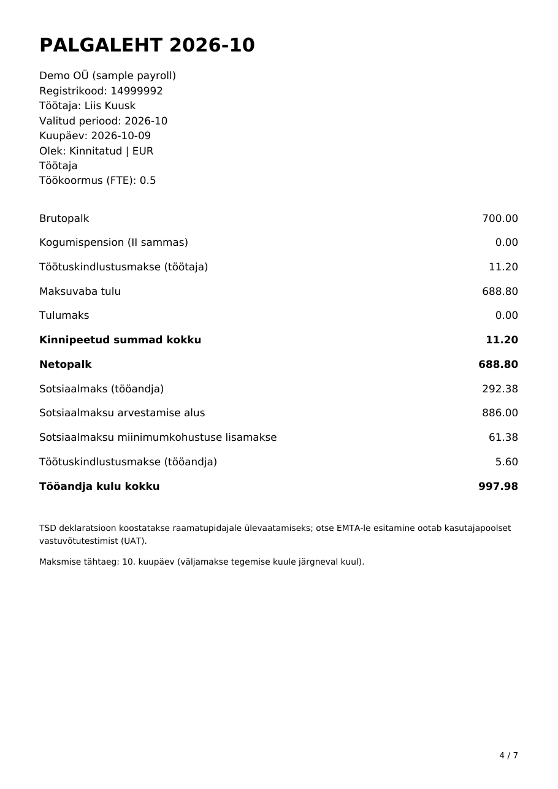

**Payslips PDF** produces one page per employee (Estonian *palgaleht*):

- gross pay, or hourly rate × hours, and the work-time fraction;
- II pillar, employee unemployment insurance, tax-free minimum used, income tax;
- net pay, social tax with its base and any **minimum top-up**, employer
  unemployment insurance and total employer cost.

Submitting the TSD return to EMTA is not automated; the accountant files it.

---

## Payroll in the ledger

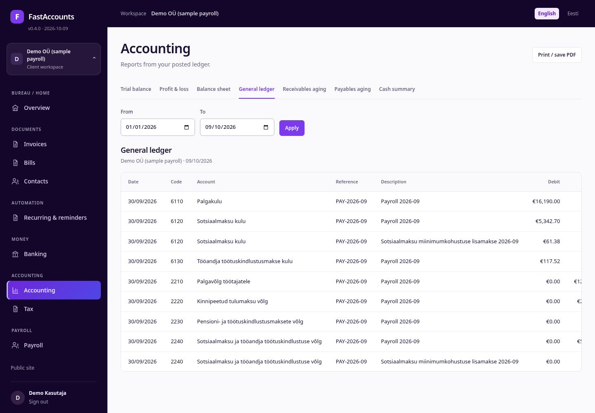

Each approved run posts to the client's payroll accounts, for example:

- **6110** salaries, **6120** social tax, **6130** employer unemployment insurance;
- **2210** net pay owed, **2220** income tax withheld, **2230** pension and
  unemployment insurance, **2240** social tax payable.

The social tax minimum top-up is a separate line with its own description, so
it is easy to explain to the client. Postings appear under their period end.

---

## Social tax minimum

| Rule | 2026 |
|---|---|
| Monthly minimum base | €886 → minimum social tax €292.38 per employee |
| Who pays the shortfall | Employer, as an extra employer cost |
| Part-month employment | Base pro-rated by calendar days employed |
| Board-member fees | Outside the obligation |
| Exemption recorded per employee | Pensioners, reduced work ability, child care, students, previously unemployed, shortened working time, council members, ship crew, foreign-service spouses, long-term sick leave, absent all month, another employer applies the exemption |

Sources: Sotsiaalmaksuseadus § 2 lg 2–4; Rahandusministri määrus nr 17;
EMTA "Sotsiaalmaks". Choose the matching **Social tax minimum exemption** on the
employee; it is printed on the payslip.

---

::: divider

## Integrations and HR import

Connect each client's HR system once, then review every imported employee
before payroll data changes.

:::

---

## Integrations

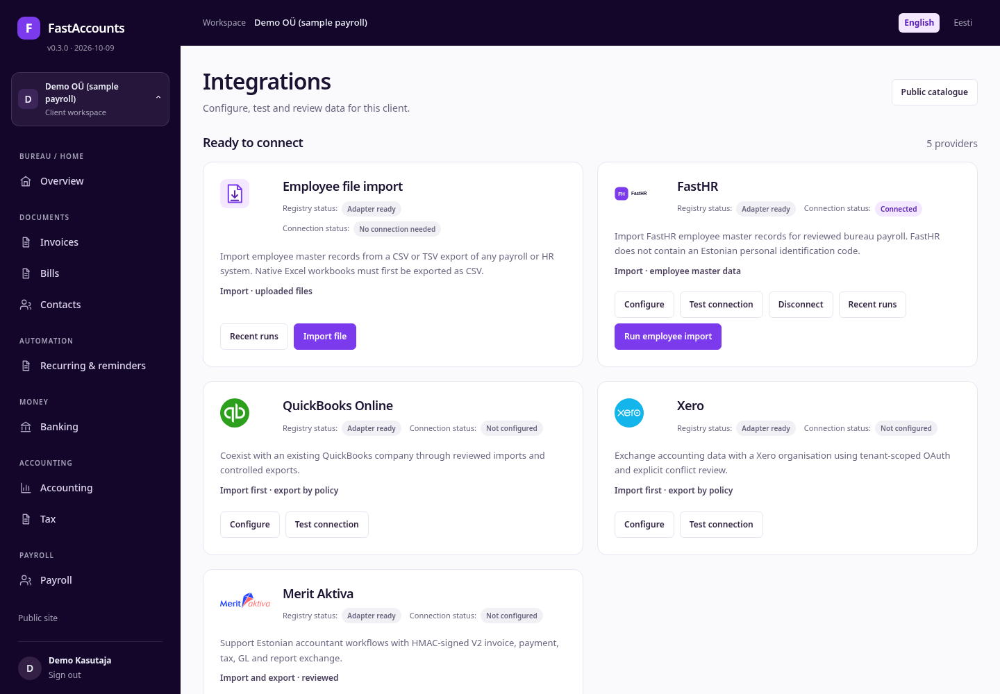

**Integrations** (under **Settings**) lists ready connectors first, with:

- **Registry status** — what the adapter supports today;
- **Connection status** — this client's connection.

**Employee file import** needs no connection; **FastHR**, **QuickBooks Online**,
**Xero** and **Merit Aktiva** are ready to connect. Planned integrations are
listed below; **Public catalogue** opens the full list on the public site.

---

## Connect FastHR

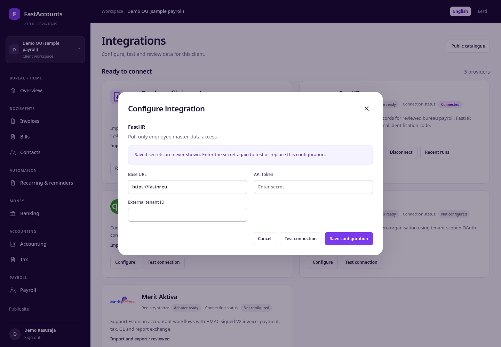

1. Click **Configure** on the FastHR card.
2. Enter the **Base URL** and the client's **API token**.
3. **Save configuration**, then **Test connection**.

Secrets are encrypted per client and never shown again; enter a new token to
replace one. **Disconnect** removes the connection; FastHR is read-only, so
nothing is ever written back.

---

## Run an employee import

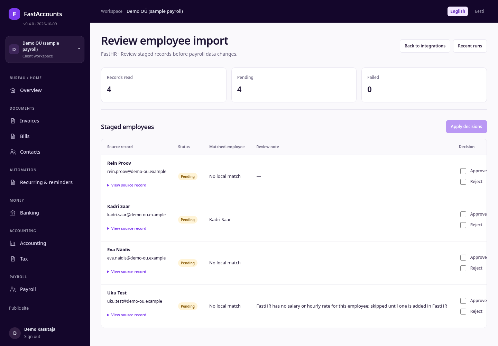

**Run employee import** stages FastHR employees for review; nothing changes yet.

- **Matched employee** links a record to an existing employee by e-mail or
  personal code.
- FastHR's annual base salary becomes the monthly gross (÷ 12); its work-time
  ratio becomes the FTE; hourly staff become hourly pay.
- A **Review note** warns when FastHR has no salary or hourly rate.

---

## Apply decisions

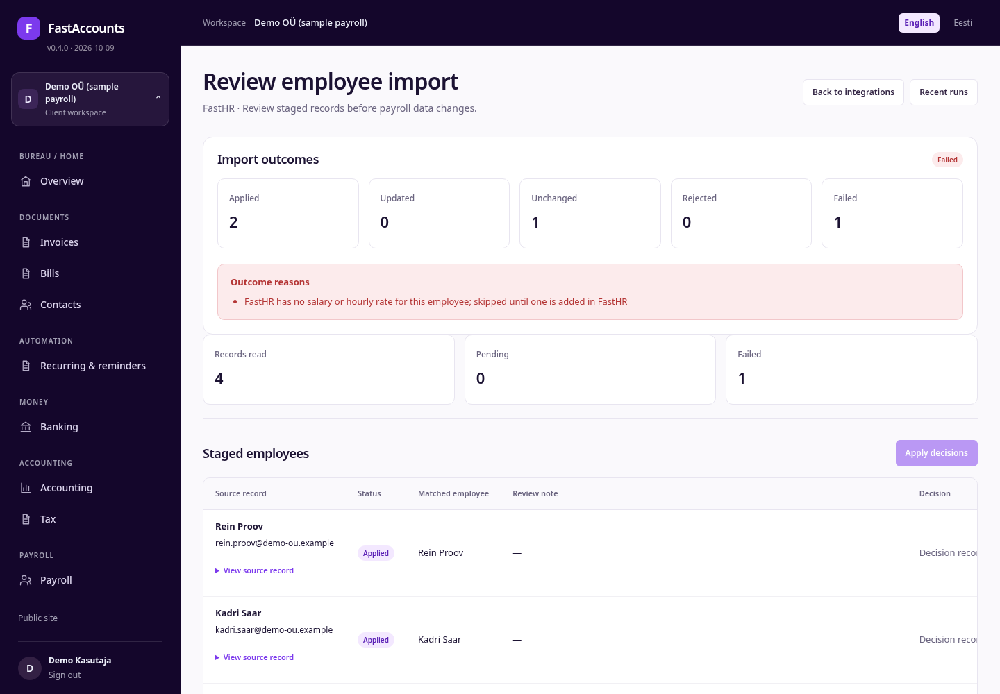

1. Tick **Approve** or **Reject** for each record.
2. **Apply decisions**.

**Import outcomes** counts applied, updated, unchanged, rejected and failed
records and lists the reasons. A record without pay is skipped, not guessed;
fix it in FastHR and use **Retry apply**. **Recent runs** keeps the history.

---

## Import an employee file

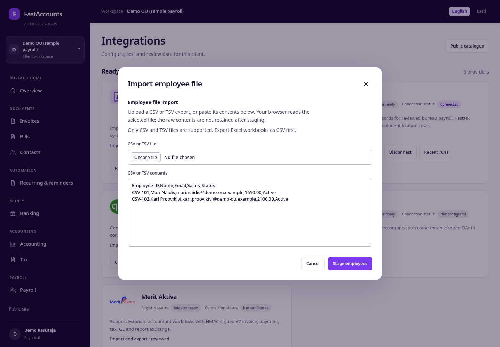

For clients whose payroll or HR system has no connector, use a file export.

1. On the **Employee file import** card, click **Import file**.
2. Choose a **CSV or TSV file**, or paste its contents.
3. **Stage employees**.

Recognised headers include *Employee ID*, *Name*, *Email*, *Salary* (monthly),
*Personal ID* and *Status*, also in Estonian (*Nimi*, *E-post*, *Palk*,
*Isikukood*). Export Excel workbooks as CSV first. The raw file is not stored.

---

## Review a file import

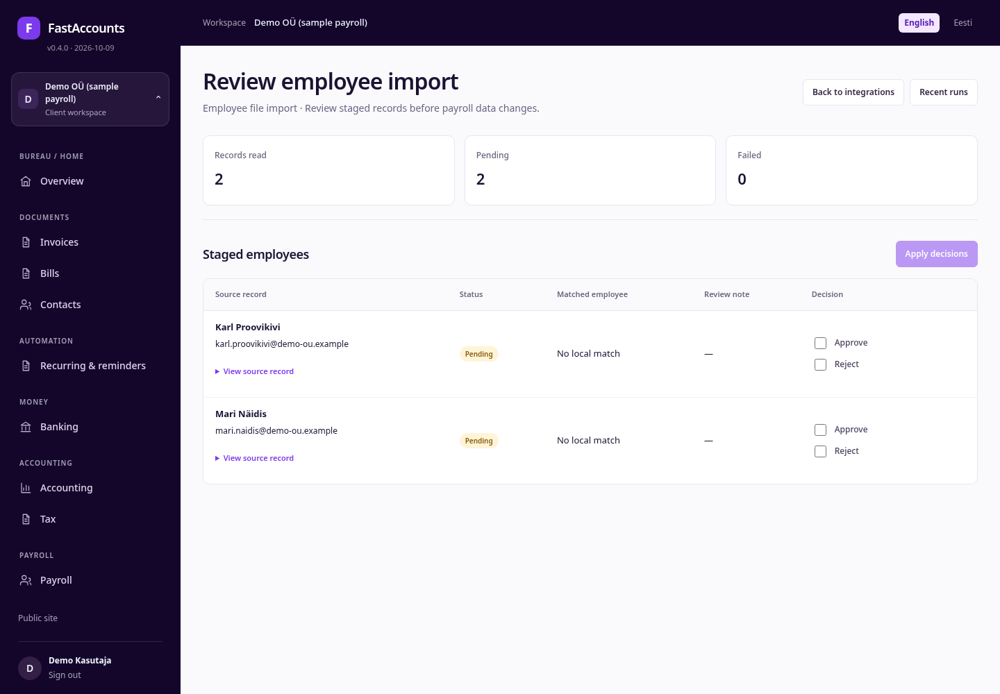

A file import uses the same review as FastHR: each row is staged as
**Pending**, matched to existing employees by e-mail or personal ID, and
changes nothing until you **Approve** it and **Apply decisions**.

Re-importing the same file is safe: unchanged rows are reported as
**Unchanged** instead of creating duplicates. **Recent runs** lists earlier
file imports for this client.

---

## Imported employees in payroll

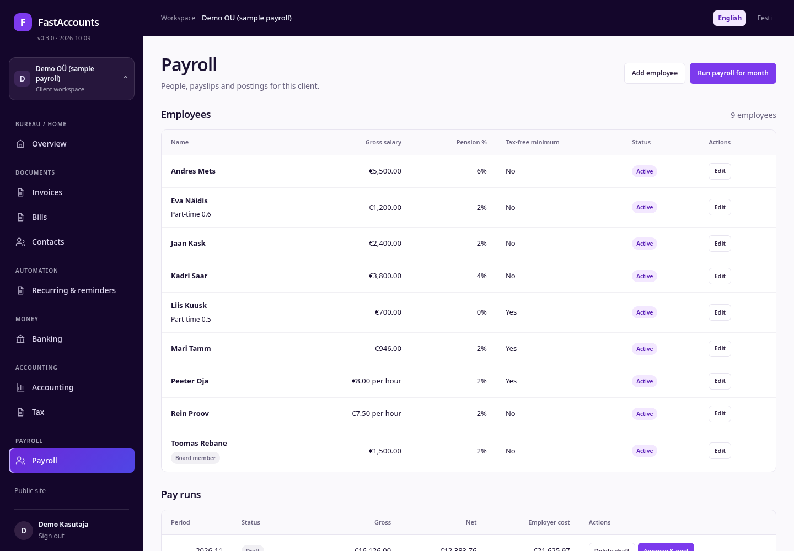

Approved records appear in **Payroll** like any other employee: here **Eva
Näidis** (part-time 0.6, €1,200.00 a month from €14,400 a year) and **Rein
Proov** (hourly, €7.50).

Before the next pay run, complete what FastHR does not hold: II pillar rate,
basic exemption application and any social tax minimum exemption.

---

::: divider

## Reference

2026 Estonian payroll rates, what FastAccounts does not do, and where to
find help.

:::

---

## Estonian payroll rates 2026

| Item | Rate or amount |
|---|---|
| Income tax | 22% |
| Basic exemption (on written application) | €700 per month |
| Social tax (employer) | 33%, minimum base €886 per month |
| Unemployment insurance | employee 1.6%, employer 0.8% |
| Funded pension (II pillar) | 0%, 2%, 4% or 6% |
| Minimum wage until 31.03.2026 | €886 per month, €5.31 per hour |
| Minimum wage from 01.04.2026 | €946 per month, €5.67 per hour |

Sources: EMTA "Maksumäärad"; Vabariigi Valitsuse määrus nr 36 (23.03.2026).
Money is calculated with exact decimals and rounded half-up to cents.

---

## Limits and next steps

- **Filing**: KMD and VD workpapers are prepared for accountant review and
  exported; nothing is filed with EMTA or HMRC automatically.
- **E-mail**: reminders and auto-e-mailed invoices need Postmark settings.
- **Payroll**: Estonian EUR books and 2026 periods only. Leave, sickness,
  benefits, non-resident cases, TSD submission and salary payments are outside
  the calculation; accountant UAT is pending (`docs/payroll_rules.md`).
- **Imports**: FastHR imports employee master data, not hours or leave.

Release notes are in `docs/change_log.md`; rebuild this guide with
`docs/USER_GUIDE_BUILD.md`.
