::: cover

# FastAccounts

#### Kasutusjuhend — klientide raamatupidamine ja palgaarvestus raamatupidamisbüroole

**Arved, pangandus, pearaamat, käibemaks ja Eesti palgaarvestus ühes büroo töölauas.**

Näidisettevõtted: Põhjatäht Teenused OÜ, Northstar Studio Ltd ja Demo OÜ (sample payroll)

v0.3.0 · 9. oktoober 2026 · Kohalik näidisväljaanne

:::

---

## Sisukord

| Peatükk | Lehed / slaidid | Mida teete |
|---|---:|---|
| **01 · Alustamine** | 3–8 | Logite sisse, loete büroo ülevaadet, vahetate klientide raamatupidamist |
| **02 · Müük, ost ja automatiseerimine** | 9–15 | Müügiarved, ostuarved, kontaktid, korduvad arved ja meeldetuletused |
| **03 · Pangandus, raamatupidamine ja maksud** | 16–19 | Pangatehingute sidumine, aruanded, KMD töölehed |
| **04 · Palgaarvestus raamatupidamisbüroole** | 20–29 | Osakoormus, tunnitasu, juhatuse liikme tasu, sotsiaalmaksu miinimumkohustus, palgaarvestused, palgalehed |
| **05 · Liidestused ja töötajate import** | 30–37 | FastHR-i ühendamine või CSV-import ja töötajate ülevaatus enne palgaandmete muutmist |
| **06 · Viited** | 38–40 | 2026. aasta määrad, erandid ja piirangud |

Ekraanipildid on tehtud kohalikus keskkonnas sünteetiliste näidisandmetega. Nimed,
isikukoodid, IBAN-id ja e-posti aadressid on testandmed, mitte päris inimesed
ega ettevõtted. FastHR-i import kasutab FastHR-i API simulatsiooni.

---

::: divider

## Alustamine

Üks töölaud kõigile klientidele: vahetage klienti külgmenüüst, hoidke iga
kliendi pearaamat eraldi ning töötage eesti või inglise keeles.

:::

---

## Avalik veebileht

**fastaccounts.org** tutvustab toodet Eesti ja Ühendkuningriigi ettevõtetele.

- Nupud **Alusta** ja **Logi sisse** viivad töölauale.
- **Liidestused** näitab iga liidestust koos selle tegeliku olekuga.
- **Hinnad**, **Miks FastAccounts**, **Raamatupidajatele** ja **Tegevuskava** kirjeldavad pakkumist.
- Keele saab valida ülemise riba keelenupust (EE / GB); valik jäetakse meelde.

Jaluses olev versiooni link avab lehe `/healthz`, mis näitab töötavat
versiooni ja andmebaasi olekut.

---

## Sisselogimine

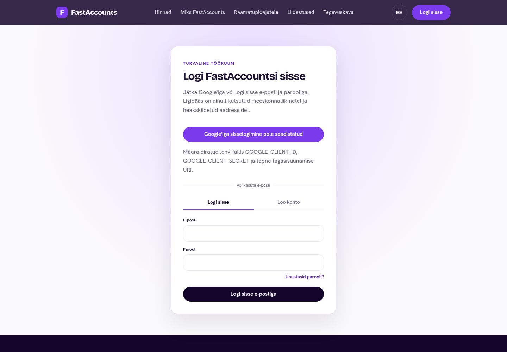

1. Avage **Logi sisse** ja valige **Jätka Google'iga**.
2. Kasutage büroo poolt lubatud Google'i kontot.
3. Töölaud avaneb **Ülevaate** vaatega.

Avatud registreerimine on teadlikult välja lülitatud. Selles kohalikus
näidiskeskkonnas pole Google'i sisselogimist seadistatud ja nupp ütleb seda;
tootmiskeskkonnas kasutatakse Google'i kontot.

---

## Büroo ülevaade

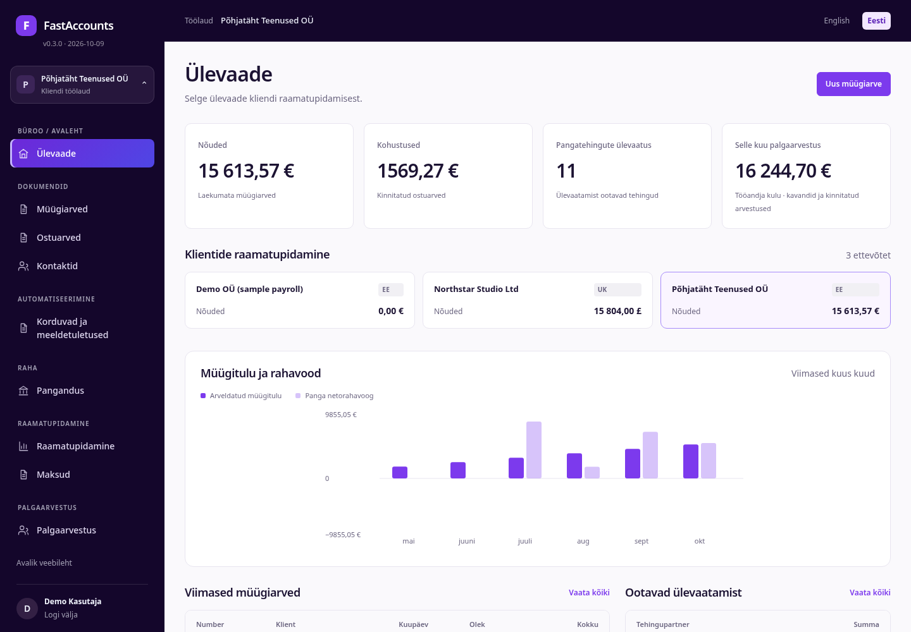

**Ülevaade** koondab valitud kliendi raamatupidamise:

- **Nõuded** ja **Kohustused** — tasumata müügiarved ja kinnitatud ostuarved.
- **Pangatehingute ülevaatus** — sidumist ootavad pangaread.
- **Selle kuu palgaarvestus** — kavandatud ja kinnitatud palgaarvestuste tööandja kulu.

**Klientide raamatupidamine** loetleb kõik teile kättesaadavad ettevõtted ja
nende nõuded. Graafik võrdleb viimase kuue kuu arveldatud tulu ja panga
netoliikumist. **Uus müügiarve** alustab kohe uut arvet.

---

## Klientide vahetamine

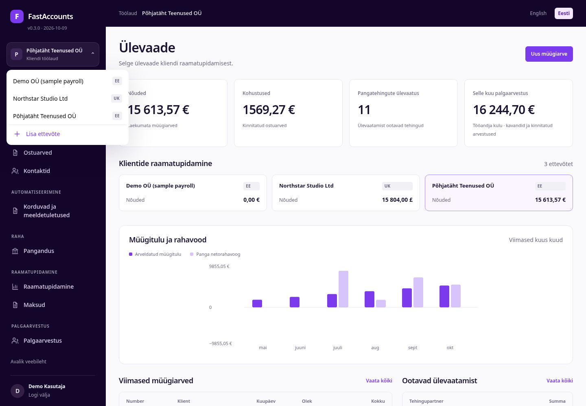

Iga klient on eraldi ettevõte oma kontoplaani, dokumentide, pangakontode,
palgaarvestuse ja liidestustega.

1. Klõpsake külgmenüü ülaosas ettevõtte kaarti.
2. Valige klient; riigitähis (EE / UK) näitab rakenduvaid reegleid.
3. **Lisa ettevõte** loob uue kliendi raamatupidamise.

Palgaarvestus on saadaval ainult eurodes peetava raamatupidamisega Eesti
ettevõtetele; teiste klientide puhul on menüüpunkt **Palgaarvestus** hall ja
selgitusega.

---

## Töölaua keel ja versioon

- **English / Eesti** ülemisel ribal vahetab kõik sildid, teated ja veateated.
  Valik jääb järgmiseks korraks meelde. Eesti palgalehed on alati eesti keeles.
- Logo all olev versioonimärk (`v0.3.0 · 2026-10-09`) näitab kasutatavat
  versiooni; klõps avab seisukontrolli.
- **Avalik veebileht** ja **Logi välja** asuvad külgmenüü allosas.

Kitsal ekraanil peitub külgmenüü nupu **☰** taha.

---

::: divider

## Müük, ost ja automatiseerimine

Koostage müügiarveid, vaadake üle ostuarved ning laske korduvatel arvetel ja
meeldetuletustel rutiinne töö ära teha.

:::

---

## Müügiarved

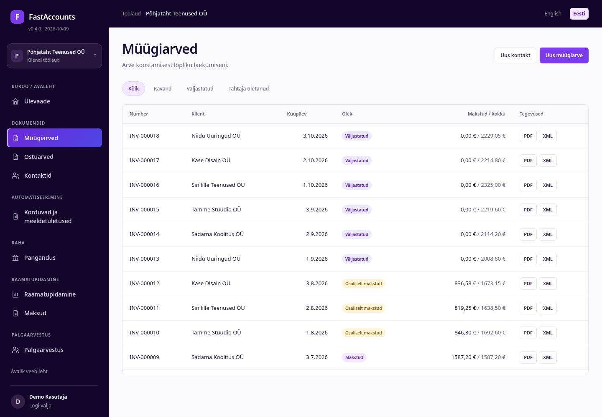

**Müügiarved** näitab iga arvet koos olekuga: **Kavand**, **Väljastatud**,
**Osaliselt makstud**, **Makstud** või **Tähtaja ületanud**. Filtreerige
nimekirja kohal olevate sakkidega.

- **PDF** laadib arve alla; **XML** laadib selle struktureeritud XML-failina.
- Kavandit saab muuta, väljastada või kustutada. Väljastatud arvet muuta ei saa
  ja see kirjendatakse pearaamatusse.
- Nupuga **Uus kontakt** lisate kliendi lehelt lahkumata.

---

## Arve koostamine

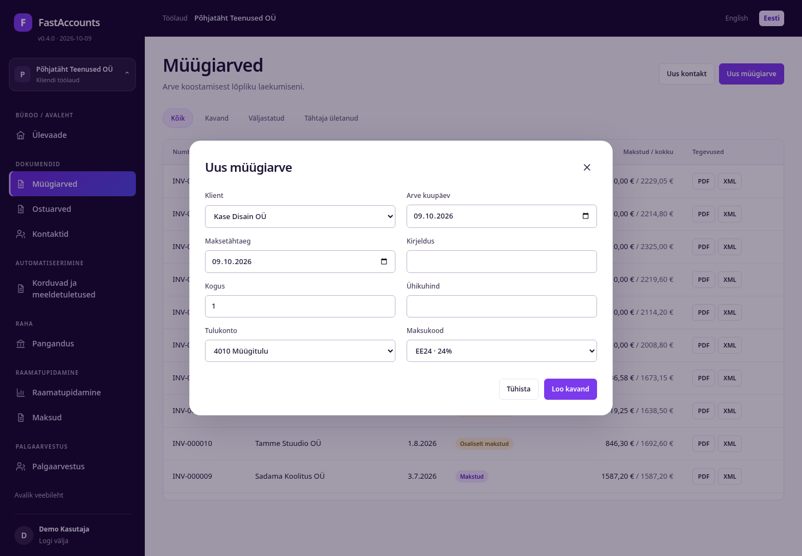

1. Klõpsake **Uus müügiarve**.
2. Valige **Klient**, **Arve kuupäev** ja **Maksetähtaeg**.
3. Sisestage **Kirjeldus**, **Kogus** ja **Ühikuhind**.
4. Valige **Tulukonto** ja **Maksukood** (näiteks EE24 – 24%).
5. **Loo kavand**, kontrollige seda ja seejärel **Väljasta**.

Käibemaks arvutatakse iga rea kohta täpsete kümnendarvudega ja kirjendatakse
arve väljastamisel kliendi käibemaksukontodele.

---

## Ostuarved

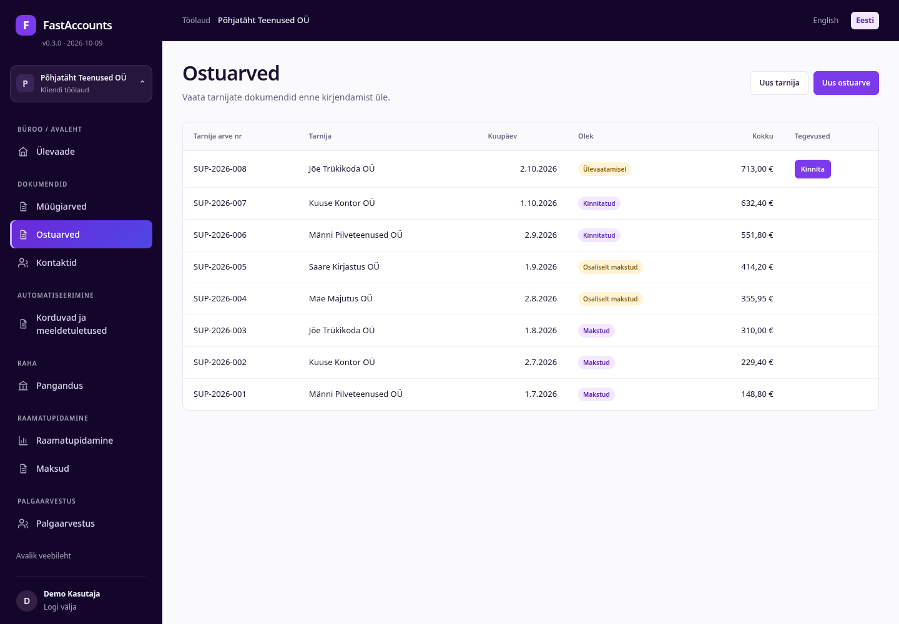

**Ostuarved** hoiab tarnijate dokumente enne pearaamatusse jõudmist.

- Olekud: **Ülevaatamisel → Kinnitatud → Osaliselt makstud → Makstud**.
- **Kinnita** kirjendab arve; ülevaatusel olev arve pearaamatusse ei jõua.
- **Uus ostuarve** ja **Uus tarnija** lisavad dokumente ja tehingupartnereid.

Kasutage ülevaatust kõige jaoks, mida raamatupidaja peab enne kontrollima,
näiteks pöördmaksustamine või mahaarvamisele mittekuuluv käibemaks.

---

## Kontaktid

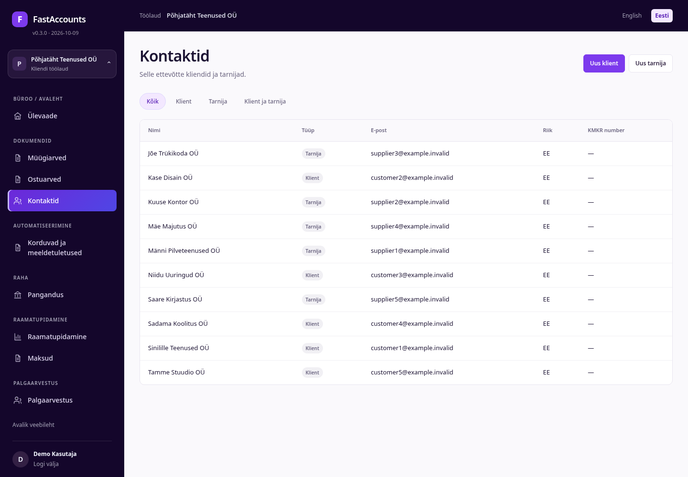

**Kontaktid** hoiab iga kliendi ostjaid ja tarnijaid koos liigi, e-posti,
riigi ja KMKR-numbriga. Filtreerige liigi järgi: ostja, tarnija või mõlemad.

Kontakte kasutavad müügi- ja ostuarved, pangatehingute sidumine ja korduvad
arved, seega hoidke e-posti aadressid ajakohased: meeldetuletused saadetakse
sinna.

---

## Korduvad arved ja meeldetuletused

**Korduvad ja meeldetuletused** näitab korduvate arvete graafikuid ja
meeldetuletuste astmeid.

- Graafik kopeerib aluseks võetud arve **igal nädalal**, **igal kuul**, **igas kvartalis** või *n* päeva
  järel. **Koosta arve kohe** muutub aktiivseks järgmise koostamise kuupäeval;
  **Peata** ja **Ajalugu** haldavad graafikut.
- **Saatmist ootavad meeldetuletused**: 3 päeva enne tähtaega, 7 ja 14 päeva
  pärast tähtaega. Valige **Saada meeldetuletus** või **Jäta vahele**.

E-kirjade saatmiseks on vaja seadistusi `POSTMARK_API_TOKEN` ja `FROM_EMAIL`;
seni teatab leht sellest ja midagi ei saadeta.

---

## Korduva arve loomine

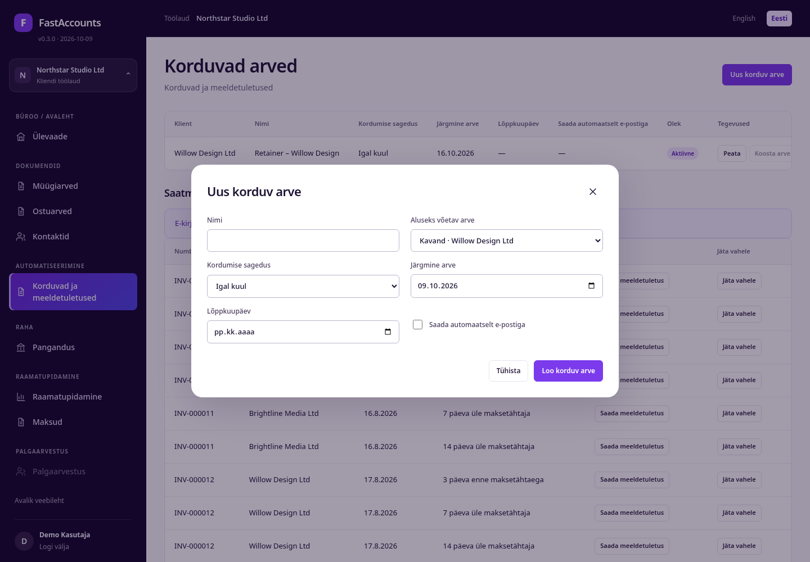

1. Koostage ja salvestage arvekavand, mida kasutada väljal **Aluseks võetav arve**.
2. Klõpsake **Uus korduv arve** ja sisestage **Nimi**.
3. Valige **Kordumise sagedus**, **Järgmine arve** ja soovi korral **Lõppkuupäev**.
4. Märkige **Saada automaatselt e-postiga**, et iga uus arve saadetaks kohe.
5. **Loo korduv arve**.

Iga koostamine loob mallist tavalise arve, nii et numeratsioon, käibemaks ja
kirjendamine järgivad samu reegleid nagu käsitsi koostatud arvetel.

---

::: divider

## Pangandus, raamatupidamine ja maksud

Siduge pangaread dokumentidega, lugege pearaamatut ja koostage
käibemaksu töölehed raamatupidaja ülevaatuseks.

:::

---

## Pangandus ja sidumine

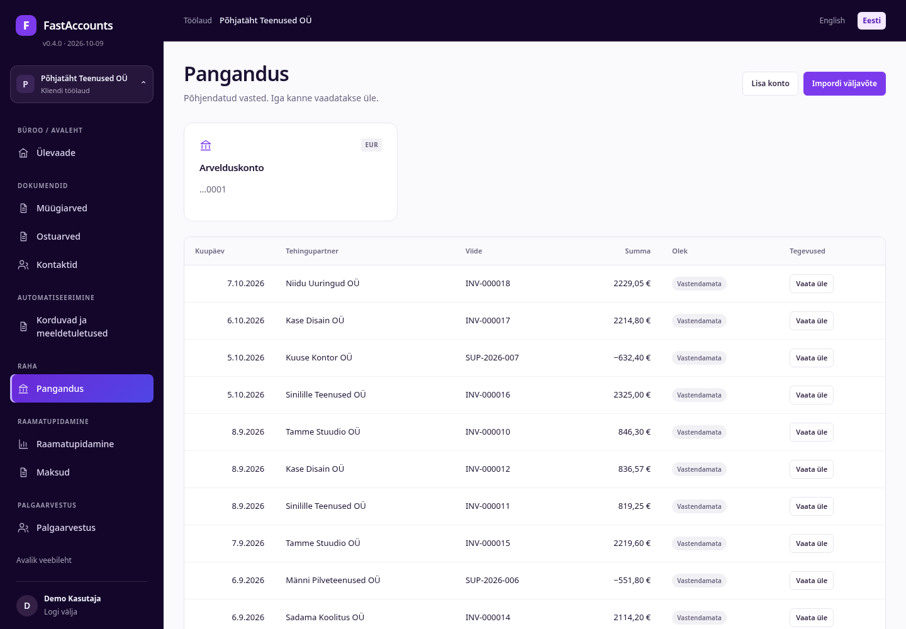

**Pangandus** näitab iga pangakontot ja selle imporditud tehinguid.

1. **Impordi väljavõte** (CSV või CAMT.053 XML).
2. Iga sidumata rea juures on põhjendatud vastete soovitused; klõpsake **Vaata üle**.
3. **Kinnita vaste**, et jaotada makse müügi- või ostuarvetele.

**Lisa konto** registreerib kliendile uue pangakonto. Kinnitatud vaste
kirjendab makse ja uuendab arvete olekuid.

---

## Raamatupidamise aruanded

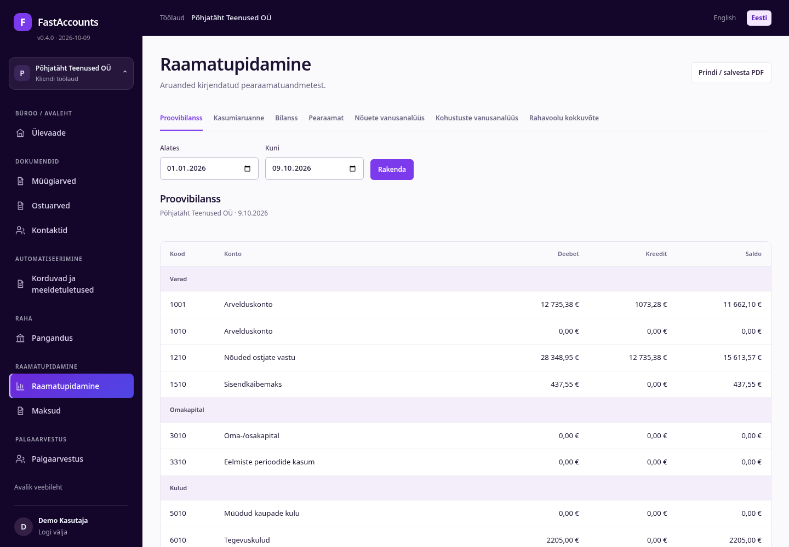

**Raamatupidamine** koostab aruanded muutumatust ja tasakaalus pearaamatust:

- **Proovibilanss**, **Kasumiaruanne**, **Bilanss**
- **Pearaamat** kõigi kannete ja viidetega
- **Nõuete vanusanalüüs**, **Kohustuste vanusanalüüs** ja **Rahavoolu kokkuvõte**

Valige **Alates** ja **Kuni**, klõpsake **Rakenda** ning kasutage kliendi
toimiku jaoks nuppu **Prindi / salvesta PDF**. Kandeid ei muudeta; parandused
tehakse uute kannetena.

---

## Käibedeklaratsiooni (KMD) töölehed

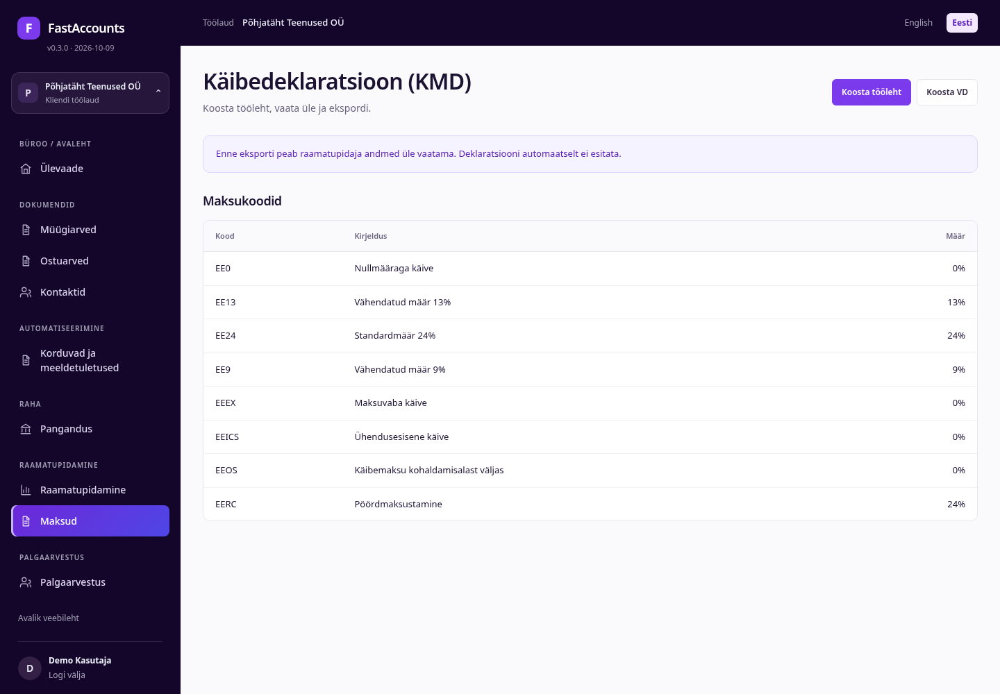

**Maksud** koostab Eesti **KMD** (Ühendkuningriigi ettevõtetele VAT-deklaratsiooni).

1. **Koosta tööleht** valitud perioodi kohta.
2. Kontrollige lahtreid loetletud maksukoodide järgi.
3. Enne eksporti **Märgi raamatupidaja poolt ülevaadatuks**.

**Koosta VD** koostab ühendusesisese käibe aruande. Eksport nõuab raamatupidaja
ülevaatust; FastAccounts ei esita deklaratsioone otse EMTA-le ega HMRC-le.

---

::: divider

## Palgaarvestus raamatupidamisbüroole

Eesti 2026. aasta palgaarvestus iga kliendi kohta: kuupalk, osakoormus,
tunnitasu ja juhatuse liikme tasu, sotsiaalmaksu miinimumkohustus, palgalehed
ja automaatsed kanded.

:::

---

## Töötajad

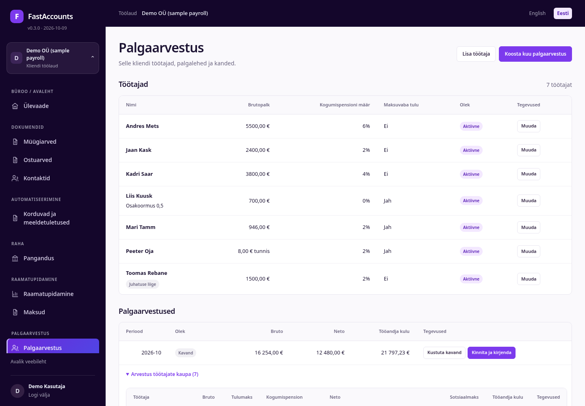

Avage eurodes peetava raamatupidamisega Eesti kliendi (siin **Demo OÜ (sample
payroll)**) **Palgaarvestus**.

- Brutotöötasu veerg näitab kuupalka või **tunnitasu tunni kohta**.
- Osakoormusega töötajal on märge (**Osakoormus 0.5**); juhatuse liikmel silt **Juhatuse liige**.
- **Kogumispensioni määr** on II samba määr (0, 2, 4 või 6%).
- Maksuvaba tulu veerg näitab, kes rakendab siin 700-eurost maksuvaba tulu.

Paremal üleval on **Lisa töötaja** ja **Koosta kuu palgaarvestus**.

---

## Osakoormusega töötaja

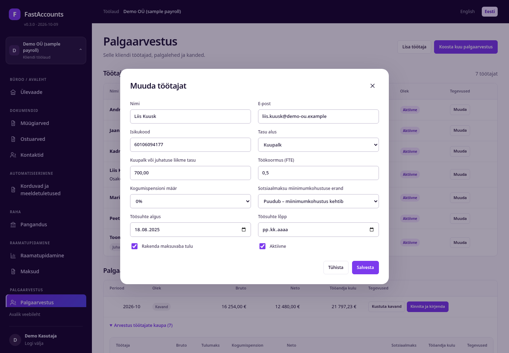

1. **Tasu alus**: **Kuupalk**.
2. **Kuupalk või juhatuse liikme tasu**: lepingujärgne kuu brutotasu (700 €).
3. **Töökoormus (FTE)**: poole kohaga 0,5.
4. **Kogumispensioni määr**: 0% on lubatud kõigile, kes II sambaga ei liitunud.

Alampalga kontroll arvestab koormust: 946 € × 0,5 = 473 € alates 1. aprillist
2026 (enne seda 886 €). Märkige **Töösuhte algus** ja **Töösuhte lõpp**, et
palgaarvestus jätaks välja väljaspool töösuhet olevad kuud.

---

## Tunnitasuga töötaja

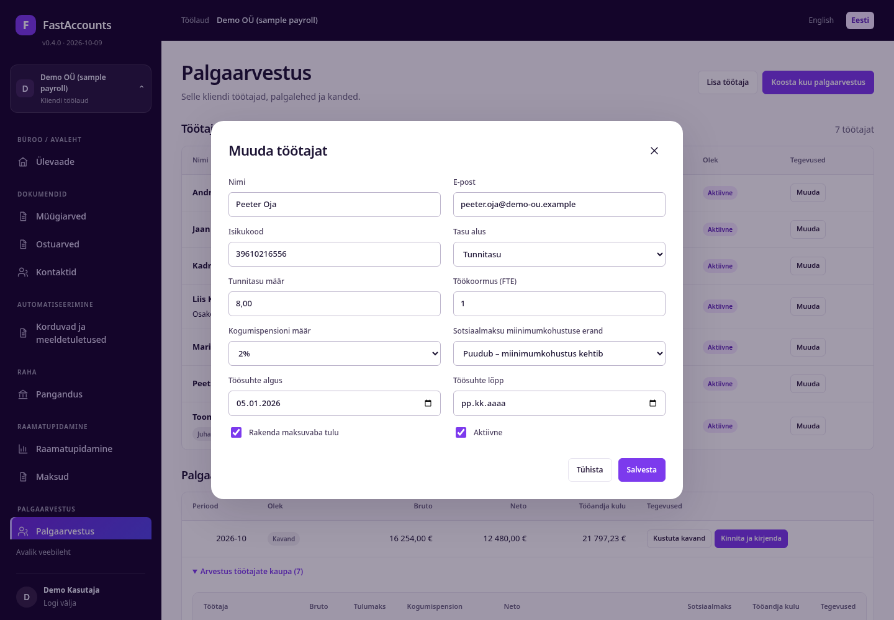

1. **Tasu alus**: **Tunnitasu**.
2. **Tunnitasu määr**: siin 8,00 €; alammäär on 5,67 €/h alates 1. aprillist
   2026 (enne seda 5,31 €).
3. Tunnid sisestatakse iga kuu palgaarvestuses.

Kolmas tasu alus on **Juhatuse liikme tasu**: töötuskindlustusmakset ja
sotsiaalmaksu miinimumkohustust ei rakendu. **Sotsiaalmaksu miinimumkohustuse
erand** näitab, miks miinimumkohustus inimesele ei kehti (vt viiteid).

---

## Palgaarvestuse kavandi ülevaatus

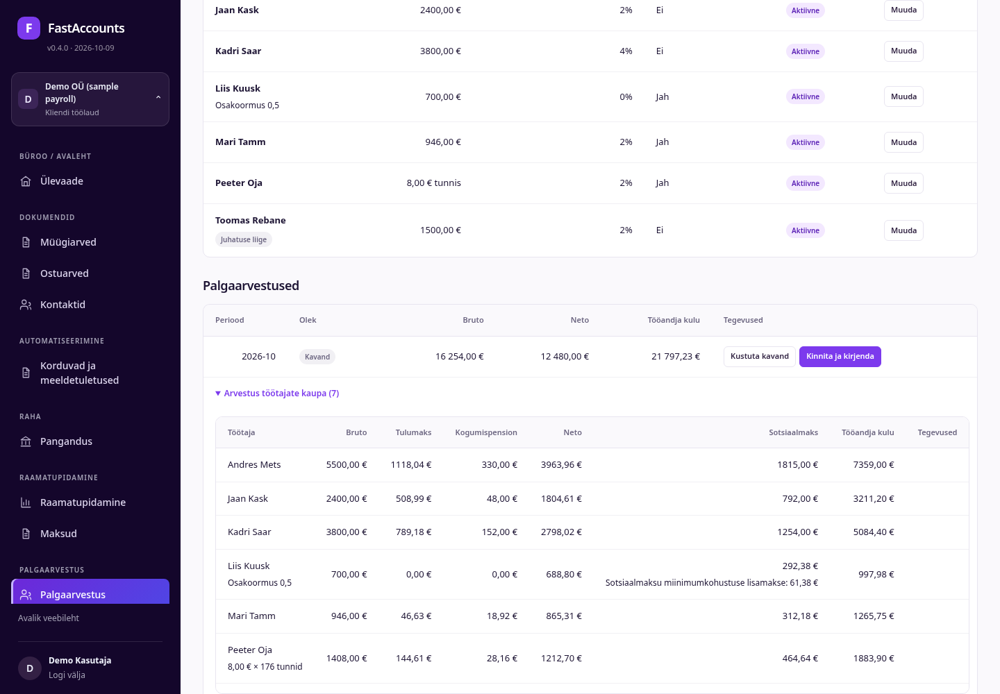

Oktoobri 2026 kavand näitab kliendi bruto-, neto- ja tööandja kulu
(bruto 16 254,00 €, tööandja kulu 21 797,23 €). **Arvestus töötajate kaupa**:

- **Peeter Oja**: 8,00 € × 176 tundi = 1408,00 € brutot.
- **Liis Kuusk** (0,5 kohta, 700 €): sotsiaalmaks 292,38 €, sh
  **sotsiaalmaksu miinimumkohustuse lisamakse** 61,38 €, mille maksab tööandja.
- Tulumaks, II sammas, netopalk ja tööandja kulu iga töötaja kohta.

---

## Kuu palgaarvestuse koostamine

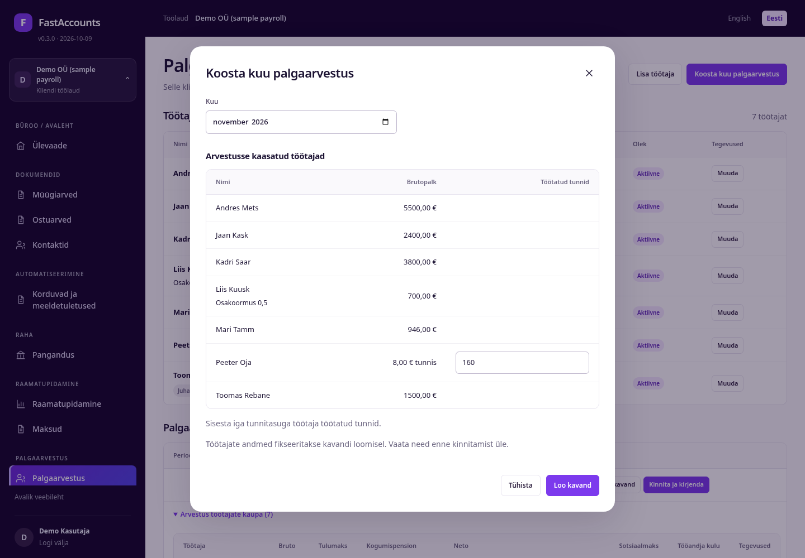

1. Klõpsake **Koosta kuu palgaarvestus** ja valige **Kuu**.
2. Kontrollige **arvestusse kaasatud töötajaid** (aktiivsed ja sel kuul töösuhtes).
3. Sisestage tunnitasuga töötajate **Töötatud tunnid**.
4. **Loo kavand** ja kinnitage.

Töötaja andmed külmutatakse kavandisse, nii et hilisemad muudatused seda ei
muuda. Alampalga kontrolli tõrge nimetab töötaja ja summa.

---

## Kinnitamine ja kirjendamine

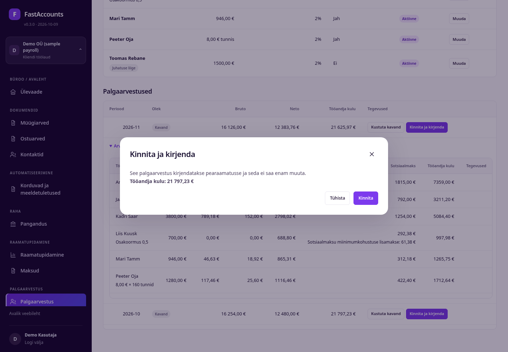

**Kinnita ja kirjenda** näitab tööandja kulu ja küsib kinnitust. Kinnitamisel:

- kirjendatakse kliendi pearaamatusse üks tasakaalus palgakanne;
- arvestus lukustub (muuta või kustutada saab ainult kavandit);
- muutuvad kättesaadavaks **Palgalehed PDF**.

Vale kavandi saab kustutada nupuga **Kustuta kavand** ja uuesti koostada.

---

## Palgalehed

**Palgalehed PDF** koostab iga töötaja kohta ühe lehe:

- brutopalk või tunnitasu × tunnid ning töökoormus;
- II sammas, töötaja töötuskindlustusmakse, kasutatud maksuvaba tulu, tulumaks;
- netopalk, sotsiaalmaks koos arvestusaluse ja võimaliku **miinimumkohustuse
  lisamaksega**, tööandja töötuskindlustusmakse ja tööandja kulu kokku.

TSD esitamine EMTA-le ei ole automatiseeritud; selle esitab raamatupidaja.

---

## Palgaarvestus pearaamatus

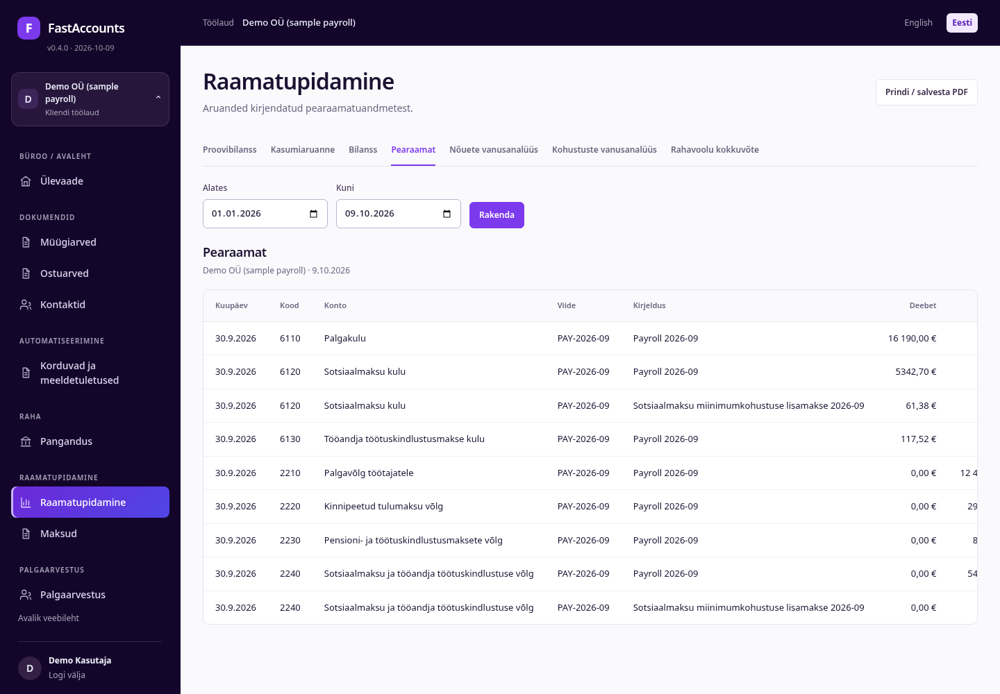

Iga kinnitatud arvestus kirjendatakse kliendi palgakontodele, näiteks:

- **6110** palgakulu, **6120** sotsiaalmaksu kulu, **6130** tööandja
  töötuskindlustusmakse kulu;
- **2210** palgavõlg töötajatele, **2220** kinnipeetud tulumaks, **2230**
  pensioni- ja töötuskindlustusmaksed, **2240** sotsiaalmaksu võlg.

Miinimumkohustuse lisamakse on eraldi rida oma kirjeldusega, nii et seda on
kliendile lihtne selgitada. Kanded on dateeritud perioodi lõpuga.

---

## Sotsiaalmaksu miinimumkohustus

| Reegel | 2026 |
|---|---|
| Kuu minimaalne arvestusalus | 886 € → minimaalne sotsiaalmaks 292,38 € töötaja kohta |
| Kes maksab puudujäägi | Tööandja, täiendava tööandja kuluna |
| Kuu keskel algav või lõppev töösuhe | Alus arvestatakse töösuhte kalendripäevade järgi |
| Juhatuse liikme tasu | Miinimumkohustus ei kehti |
| Töötaja juures märgitav erand | Pensionär, osaline või puuduv töövõime, lapse kasvatamine, õpilane, varem töötu, lühendatud tööaeg, volikogu liige, laevapere liige, välisteenistuja abikaasa, pikaajaline haigusleht, terve kuu eemal, maksuvaba tulu arvestab teine tööandja |

Allikad: sotsiaalmaksuseadus § 2 lg 2–4; rahandusministri määrus nr 17; EMTA
„Sotsiaalmaks“. Valige töötaja juures sobiv **sotsiaalmaksu miinimumkohustuse
erand**; see trükitakse palgalehele.

---

::: divider

## Liidestused ja töötajate import

Ühendage iga kliendi personalitarkvara üks kord ja vaadake iga imporditud
töötaja üle enne, kui palgaandmed muutuvad.

:::

---

## Liidestused

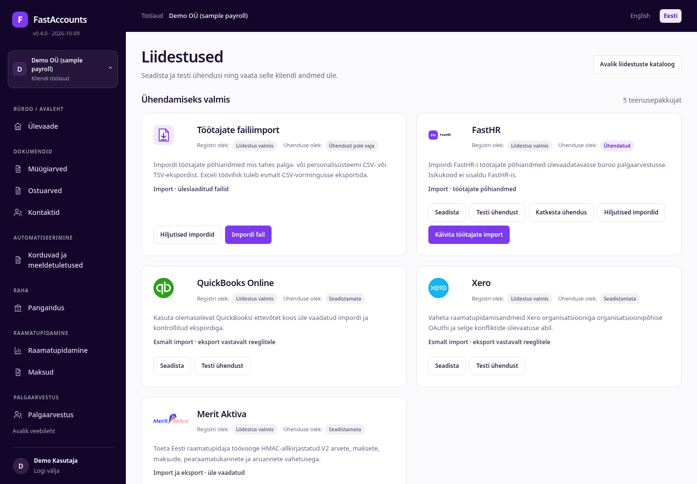

**Liidestused** (menüüs **Seaded**) näitab esmalt kasutusvalmis liidestusi:

- **Registri olek** — mida liidestus täna toetab;
- **Ühenduse olek** — selle kliendi ühendus.

**Töötajate failiimport** ei vaja ühendust; **FastHR**, **QuickBooks Online**,
**Xero** ja **Merit Aktiva** on ühendamiseks valmis. Kavandatud liidestused on
all; **Avalik liidestuste kataloog** avab täieliku nimekirja avalikul veebilehel.

---

## FastHR-i ühendamine

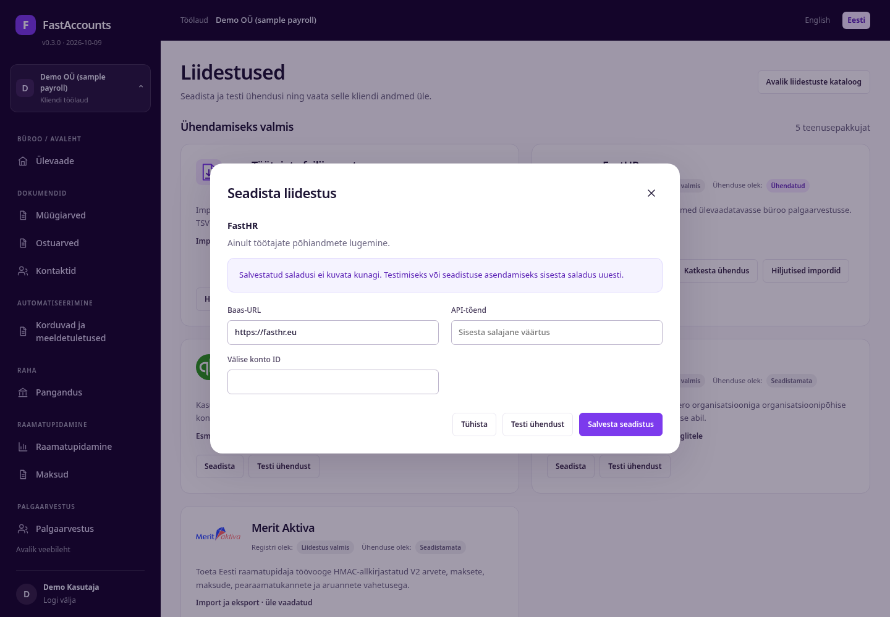

1. Klõpsake FastHR-i kaardil **Seadista**.
2. Sisestage **Baas-URL** ja kliendi **API-tõend**.
3. **Salvesta seadistus** ja seejärel **Testi ühendust**.

Saladused krüpteeritakse kliendi kaupa ja neid ei näidata enam kunagi; tõendi
vahetamiseks sisestage uus. **Katkesta ühendus** eemaldab ühenduse; FastHR-i
ainult loetakse, sinna ei kirjutata midagi tagasi.

---

## Töötajate impordi käivitamine

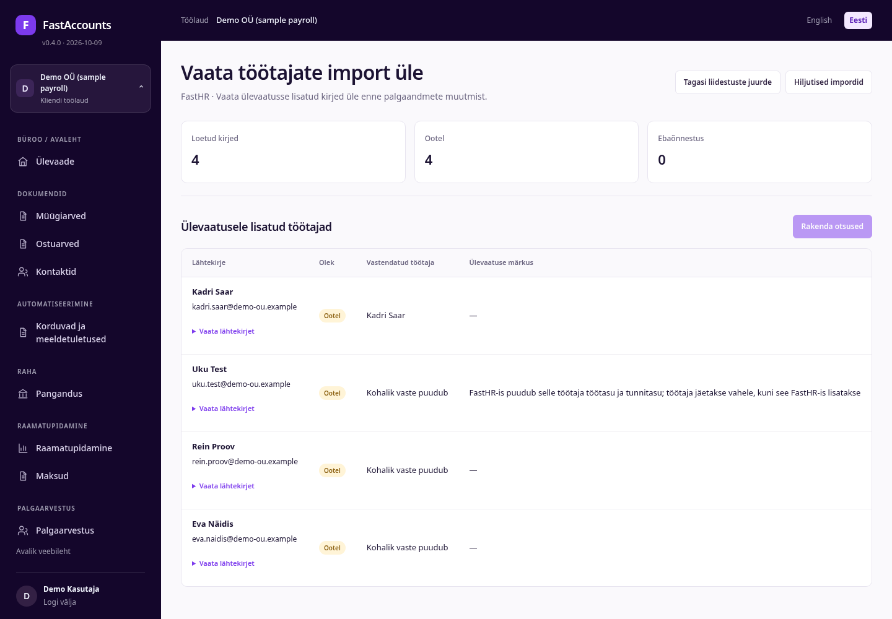

**Käivita töötajate import** lisab FastHR-i töötajad ülevaatusele; midagi ei muutu veel.

- **Vastendatud töötaja** seob kirje olemasoleva töötajaga e-posti või isikukoodi järgi.
- FastHR-i aasta põhitöötasu muutub kuupalgaks (÷ 12), tööaja osakaal
  töökoormuseks (FTE) ja tunnitasuga töötajad saavad tunnitasu.
- **Ülevaatuse märkus** hoiatab, kui FastHR-is puudub töötasu ja tunnitasu.

---

## Otsuste rakendamine

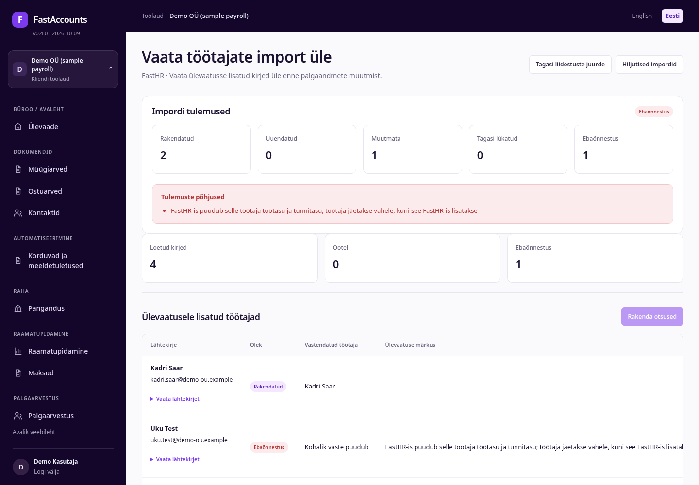

1. Märkige iga kirje juures **Kinnita** või **Lükka tagasi**.
2. **Rakenda otsused**.

**Impordi tulemused** loendab rakendatud, uuendatud, muutmata, tagasi lükatud
ja ebaõnnestunud kirjed ning näitab põhjuseid. Töötasuta kirje jäetakse vahele,
mitte ei arvata; parandage see FastHR-is ja valige **Proovi rakendamist uuesti**.
**Hiljutised impordid** säilitab ajaloo.

---

## Töötajate faili importimine

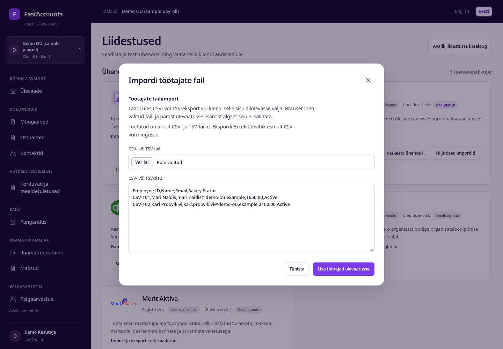

Kui kliendi palga- või personalisüsteemil liidestust pole, kasutage faili eksporti.

1. Klõpsake kaardil **Töötajate failiimport** nuppu **Impordi fail**.
2. Valige **CSV- või TSV-fail** või kleepige selle sisu.
3. **Lisa töötajad ülevaatusse**.

Tuntud veerupealkirjad on näiteks *Töötaja ID*, *Nimi*, *E-post*, *Palk*
(kuupalk), *Isikukood* ja *Staatus*, samuti ingliskeelsed vasted. Exceli
töövihik eksportige enne CSV-vormingusse. Algfaili ei salvestata.

---

## Failiimpordi ülevaatus

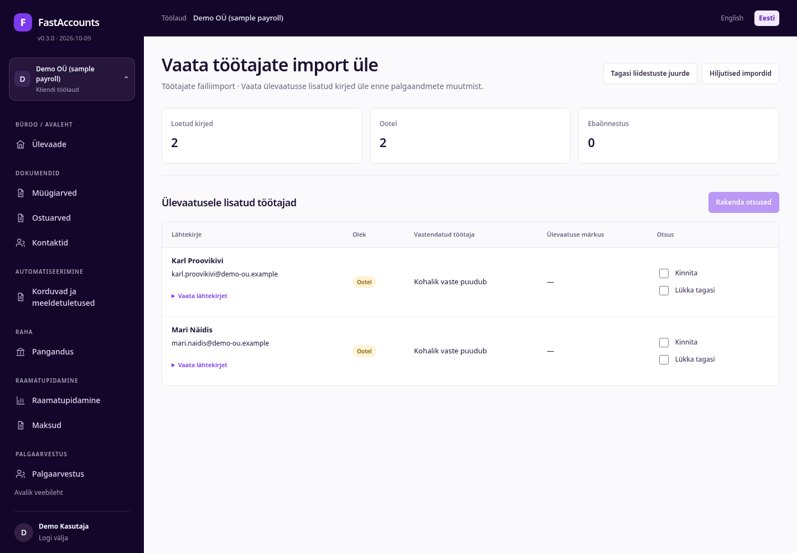

Failiimport kasutab sama ülevaatust nagu FastHR: iga rida lisatakse olekuga
**Ootel**, vastendatakse olemasolevate töötajatega e-posti või isikukoodi järgi
ja midagi ei muutu enne, kui valite **Kinnita** ja **Rakenda otsused**.

Sama faili uuesti importimine on ohutu: muutmata read märgitakse olekuga
**Muutmata** ja duplikaate ei teki. **Hiljutised impordid** näitab selle kliendi
varasemaid failiimporte.

---

## Imporditud töötajad palgaarvestuses

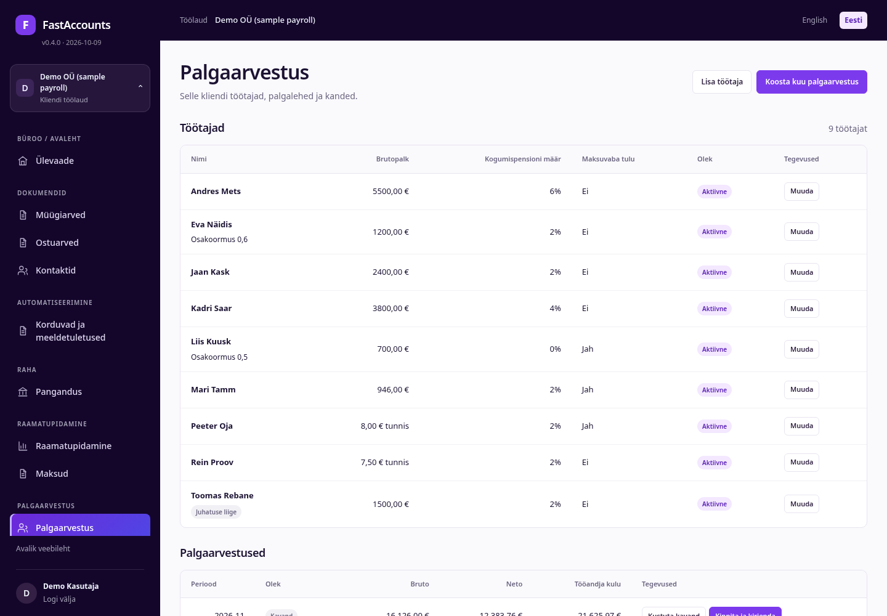

Kinnitatud kirjed on **Palgaarvestuses** nagu teised töötajad: siin **Eva
Näidis** (osakoormus 0,6, kuupalk 1200,00 € aastatasust 14 400 €) ja **Rein
Proov** (tunnitasu 7,50 €).

Enne järgmist palgaarvestust täiendage, mida FastHR ei hoia: II samba määr,
maksuvaba tulu avaldus ja võimalik sotsiaalmaksu miinimumkohustuse erand.

---

::: divider

## Viited

Eesti 2026. aasta palgaarvestuse määrad, mida FastAccounts ei tee ja kust
abi leida.

:::

---

## Eesti palgaarvestuse määrad 2026

| Kirje | Määr või summa |
|---|---|
| Tulumaks | 22% |
| Maksuvaba tulu (kirjaliku avalduse alusel) | 700 € kuus |
| Sotsiaalmaks (tööandja) | 33%, minimaalne arvestusalus 886 € kuus |
| Töötuskindlustusmakse | töötaja 1,6%, tööandja 0,8% |
| Kogumispension (II sammas) | 0%, 2%, 4% või 6% |
| Alampalk kuni 31.03.2026 | 886 € kuus, 5,31 € tunnis |
| Alampalk alates 01.04.2026 | 946 € kuus, 5,67 € tunnis |

Allikad: EMTA „Maksumäärad“; Vabariigi Valitsuse 23.03.2026 määrus nr 36.
Summad arvutatakse täpsete kümnendarvudega ja ümardatakse sentideni (pooled üles).

---

## Piirangud ja järgmised sammud

- **Deklaratsioonid**: KMD ja VD töölehed koostatakse raamatupidaja
  ülevaatuseks ja eksporditakse; EMTA-le ega HMRC-le ei esitata midagi automaatselt.
- **E-kirjad**: meeldetuletused ja automaatselt saadetavad arved vajavad
  Postmarki seadistust.
- **Palgaarvestus**: ainult eurodes peetava raamatupidamisega Eesti ettevõtted ja
  2026. aasta perioodid. Puhkused, haigused, hüvitised, mitteresidendid, TSD
  esitamine ja palga väljamaksmine jäävad arvestusest välja; raamatupidaja
  vastuvõtutestimine on pooleli (`docs/payroll_rules.md`).
- **Import**: FastHR-ist imporditakse töötajate põhiandmed, mitte tunde ega puhkusi.

Muudatuste logi on failis `docs/change_log.md`; juhendi uuesti koostamise
kirjeldus on failis `docs/USER_GUIDE_BUILD.md`.
